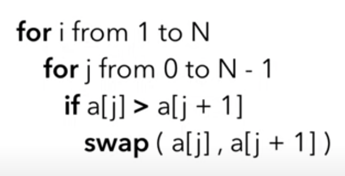

# Bubble sort
* repeatedly steps through a list and swaps adjacent items
* O(n^2)

## Pseudocode

## JavaScript implementation
<pre>
<code class="language-javascript">
const arr = [1,6,2,9,33,6,1,3];

for (let i = 0; i < arr.length; i++) {
  for (let j = 0; j < arr.length-1; j++) {
    if (arr[j] > arr[j+1]) {
      const temp = arr[j];
      arr[j] = arr[j+1];
      arr[j+1] = temp;
    }
  }
}

console.log(arr);
</code>
</pre>

## Optimisation
Add a boolean to check if any swaps occurred. The array is sorted if there are no swaps, so the loop can break.

<pre>
<code class="language-javascript">
const arr = [1,6,2,9,33,6,1,3];
let swap = false;

for (let i = 0; i < arr.length; i++) {
  swap = false;
  for (let j = 0; j < arr.length-1; j++) {
    if (arr[j] > arr[j+1]) {
      const temp = arr[j]; // temp variable stores value while swapping.
      arr[j] = arr[j+1];
      arr[j+1] = temp;
      swap = true;
    }
  }
  if (!swap) {
    break;
  }
}

console.log(arr);
</code>
</pre>