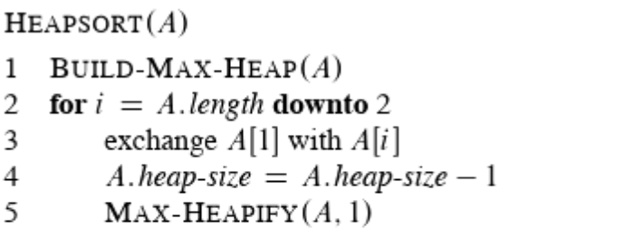

# Heap sort
* Sorts <a href="../topics/heap.html">heaps</a>
* Recursive
* O(nlogn)

## Pseudocode

## JavaScript implementation (max-heap)
<pre>
<code class="language-javascript">
const heap = [0,1,2,3,4,5,6,7];

function maxHeapify(arr, i) {
  let l = i * 2 + 1;
  let r = i * 2 + 2;
  let largest = i;
  if (l <= arr.length-1 && arr[l] > arr[i]) {
    largest = l;
  }
  if (r <= arr.length-1 && arr[r] > arr[i]) {
    largest = r;
  }
  if (largest != i) {
    // exchange arr[i] with arr[largest].
    const temp = arr[i];
    arr[i] = arr[largest];
    arr[largest] = temp;
    maxHeapify(arr, largest);
  }
}

// Build max heap.
function buildMaxHeap(arr) {
  for (let i = Math.floor(arr.length/2); i >= 0; i--) {
    maxHeapify(arr, i);
  }
}

// Heapsort.
function heapsort(arr) {
  buildMaxHeap(arr);
  for (let i = arr.length-1; i >= 1; i--) {
    // exchange arr[0] with arr[i].
    let temp = arr[0];
    arr[0] = arr[i];
    arr[i] = temp;
    maxHeapify(arr, 0);
  }
  return arr;
}

console.log('heap sorted', heapsort(heap));
</code>
</pre>
